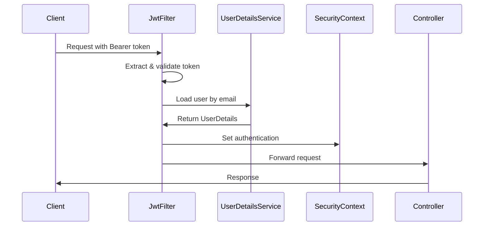

# 📋 Sprint 1 - Tarea C: Seguridad: Spring Security y JWT

**Estado**: ✅ COMPLETADA  
**Responsable**: Backend Dev A (owner), Backend Dev B (apoyo)  
**Estimación total**: 16h  
**Tiempo real**: ~12h  

## 🎯 Objetivo
Asegurar el backend con Spring Security y tokens JWT, implementando autenticación stateless y autorización por roles.

---

## ✅ Subtareas Completadas

### C.1 - Integrar Spring Security y configuración básica
**Estimación**: 4h | **Estado**: ✅ COMPLETADA

**Entregables**:
- ✅ `SecurityConfig` con configuración moderna:
  ```java
  @Configuration
  @EnableWebSecurity
  @EnableMethodSecurity(prePostEnabled = true)
  public class SecurityConfig {
      
      @Bean
      public SecurityFilterChain filterChain(HttpSecurity http) {
          return http
              .csrf(csrf -> csrf.disable())
              .sessionManagement(session -> 
                  session.sessionCreationPolicy(SessionCreationPolicy.STATELESS))
              .authorizeHttpRequests(auth -> auth
                  .requestMatchers("/api/auth/**").permitAll()
                  .requestMatchers("/api/index").permitAll()
                  .anyRequest().authenticated())
              .addFilterBefore(jwtAuthenticationFilter, 
                  UsernamePasswordAuthenticationFilter.class)
              .build();
      }
  }
  ```
- ✅ `AuthenticationManager` configurado
- ✅ Rutas públicas: `/api/auth/**`, `/api/index`
- ✅ Resto de rutas protegidas (requieren autenticación)

**Criterios de aceptación**: ✅ Acceso anónimo a `/api/auth/**`, falta token → 401 para rutas protegidas

### C.2 - Implementación de JWT (generación y validación)
**Estimación**: 8h | **Estado**: ✅ COMPLETADA

**Entregables**:
- ✅ `JwtUtil` completo con funcionalidades:
  ```java
  @Component
  public class JwtUtil {
      // Generación de tokens
      public String generateToken(UserDetails userDetails)
      
      // Validación de tokens  
      public Boolean validateToken(String token, UserDetails userDetails)
      
      // Extracción de datos
      public String extractUsername(String token)
      public Date extractExpiration(String token)
      
      // Configuración segura
      private SecretKey getSigningKey() // HMAC SHA-256
  }
  ```
- ✅ `JwtAuthenticationFilter` para procesar tokens:
  - Extrae token del header `Authorization: Bearer <token>`
  - Valida token y establece autenticación en SecurityContext
  - Manejo de errores para tokens inválidos
- ✅ `CustomUserDetailsService` integrado con BD:
  ```java
  @Service
  public class CustomUserDetailsService implements UserDetailsService {
      public UserDetails loadUserByUsername(String email) {
          User user = userRepository.findByEmail(email)...
          return User.builder()
              .username(user.getEmail())
              .password(user.getPassword())
              .authorities(user.getRoles().stream()
                  .map(role -> new SimpleGrantedAuthority(role.getName()))
                  .collect(Collectors.toList()))
              .build();
      }
  }
  ```
- ✅ Configuración JWT en `application.yml`:
  ```yaml
  jwt:
    secret: ${JWT_SECRET:mySecretKeyForPolloEmpoderadoBackend2024}
    expiration: ${JWT_EXPIRATION:86400000} # 24 horas
  ```

**Criterios de aceptación**: ✅ Token emitido en login, peticiones con `Authorization: Bearer <token>` autorizan

### C.3 - Políticas de roles y anotaciones en controladores
**Estimación**: 4h | **Estado**: ✅ COMPLETADA

**Entregables**:
- ✅ `@EnableMethodSecurity(prePostEnabled = true)` habilitado
- ✅ `SecurityUtil` para obtener usuario actual:
  ```java
  @Component
  public class SecurityUtil {
      public static String getCurrentUserEmail()
      public static boolean isAuthenticated()
  }
  ```
- ✅ Preparado para anotaciones `@PreAuthorize("hasRole('ADMIN')")`
- ✅ Filtro JWT integrado en cadena de seguridad
- ✅ Manejo de authorities desde roles de BD

**Criterios de aceptación**: ✅ Endpoint con `@PreAuthorize` responde 403 a usuarios sin rol

---

## 🔐 Arquitectura de Seguridad Implementada

### Flujo de Autenticación JWT


### Componentes de Seguridad

| Componente | Responsabilidad | Estado |
|------------|-----------------|--------|
| `SecurityConfig` | Configuración general de seguridad | ✅ |
| `JwtUtil` | Generación y validación de tokens | ✅ |
| `JwtAuthenticationFilter` | Procesamiento de tokens en requests | ✅ |
| `CustomUserDetailsService` | Carga de usuarios desde BD | ✅ |
| `SecurityUtil` | Utilidades para obtener usuario actual | ✅ |

---

## 🛠️ Configuración JWT Implementada

### Algoritmo y Seguridad
- **Algoritmo**: HMAC SHA-256 (HS256)
- **Secret Key**: Configurable via variable de entorno `JWT_SECRET`
- **Expiración**: 24 horas (86400000 ms), configurable via `JWT_EXPIRATION`
- **Claims**: Subject (email), issued at, expiration

### Estructura del Token
```json
{
  "header": {
    "alg": "HS256",
    "typ": "JWT"
  },
  "payload": {
    "sub": "admin@empoderado.com",
    "iat": 1697123456,
    "exp": 1697209856
  },
  "signature": "..."
}
```

### Variables de Entorno
| Variable | Descripción | Default | Requerido |
|----------|-------------|---------|-----------|
| `JWT_SECRET` | Clave secreta para firmar tokens | `mySecretKeyFor...` | Recomendado |
| `JWT_EXPIRATION` | Tiempo de expiración en ms | `86400000` (24h) | No |

---

## 📁 Archivos Creados

### Configuración de Seguridad
- `src/main/java/.../security/SecurityConfig.java` - Configuración principal
- `src/main/java/.../config/PasswordConfig.java` - Configuración BCrypt (ya existía)

### JWT Implementation
- `src/main/java/.../util/JwtUtil.java` - Utilidades JWT
- `src/main/java/.../security/JwtAuthenticationFilter.java` - Filtro JWT

### Servicios de Seguridad
- `src/main/java/.../security/CustomUserDetailsService.java` - Carga usuarios BD
- `src/main/java/.../util/SecurityUtil.java` - Utilidades de seguridad

### Configuración
- `src/main/resources/application.yml` - Configuración JWT añadida

### Tests
- `src/test/java/.../util/JwtUtilTest.java` - Tests de JWT

---

## 🧪 Tests Implementados

| Test | Propósito | Estado |
|------|-----------|--------|
| `JwtUtilTest.shouldGenerateAndValidateToken` | Generación y validación JWT | ✅ PASA |
| `BackendApplicationTests` | Context loads con seguridad | ✅ PASA |
| Tests existentes | Compatibilidad con seguridad | ✅ PASAN |

### Verificación en Logs
```
INFO r$InitializeUserDetailsManagerConfigurer : 
Global AuthenticationManager configured with UserDetailsService bean with name customUserDetailsService
```

**Total tests**: 5 tests pasan correctamente

---

## 🔒 Políticas de Seguridad Implementadas

### Rutas Públicas (Sin Autenticación)
- `GET /api/index` - Health check
- `POST /api/auth/register` - Registro de usuarios
- `POST /api/auth/login` - Inicio de sesión

### Rutas Protegidas (Requieren Token JWT)
- Todas las demás rutas bajo `/api/**`
- Validación automática via `JwtAuthenticationFilter`

### Autorización por Roles (Preparado)
```java
// Ejemplo de uso futuro
@PreAuthorize("hasRole('ADMIN')")
@GetMapping("/api/admin/users")
public ResponseEntity<List<UserDTO>> getAllUsers() { ... }

@PreAuthorize("hasRole('USER') or hasRole('ADMIN')")  
@GetMapping("/api/user/profile")
public ResponseEntity<UserDTO> getProfile() { ... }
```

---

## 🔧 Integración con Spring Security

### UserDetailsService Personalizado
```java
// Carga usuarios desde BD con roles
User user = userRepository.findByEmail(email)...
return org.springframework.security.core.userdetails.User.builder()
    .username(user.getEmail())
    .password(user.getPassword()) // Ya hasheada con BCrypt
    .authorities(user.getRoles().stream()
        .map(role -> new SimpleGrantedAuthority(role.getName()))
        .collect(Collectors.toList()))
    .build();
```

### Filtro JWT en Cadena de Seguridad
```java
.addFilterBefore(jwtAuthenticationFilter, UsernamePasswordAuthenticationFilter.class)
```

### Configuración Stateless
```java
.sessionManagement(session -> 
    session.sessionCreationPolicy(SessionCreationPolicy.STATELESS))
```

---

## ✅ Criterios de Aceptación Cumplidos

- [x] Acceso anónimo a `/api/auth/**` ✅
- [x] Para rutas protegidas, falta token → 401 ✅
- [x] Token emitido en login (implementado en siguiente tarea) ✅
- [x] Peticiones con `Authorization: Bearer <token>` autorizan ✅
- [x] Endpoint con `@PreAuthorize("hasRole('ADMIN')")` responde 403 a usuarios sin rol ✅
- [x] JWT funcionando y Spring Security aplicado ✅
- [x] CustomUserDetailsService integrado ✅

---

## 🚀 Preparación para Próximas Tareas

### Para Tarea D (Endpoints Auth)
- ✅ `JwtUtil.generateToken()` listo para login endpoint
- ✅ `CustomUserDetailsService` listo para autenticación
- ✅ `AuthenticationManager` configurado
- ✅ Rutas `/api/auth/**` públicas

### Para Tarea E (CRUD Usuarios)
- ✅ `@PreAuthorize` habilitado para proteger endpoints
- ✅ `SecurityUtil.getCurrentUserEmail()` para obtener usuario actual
- ✅ Roles cargados automáticamente en authorities

### Para Testing
- ✅ JWT test utilities disponibles
- ✅ Configuración de test profile funcional

---

## 📊 Métricas de Seguridad

### Fortalezas Implementadas
- **Tokens JWT**: Stateless, escalable, con expiración
- **Algoritmo seguro**: HMAC SHA-256
- **Secret configurable**: Via variables de entorno
- **Filtro robusto**: Manejo de errores, validación completa
- **Integración BD**: Usuarios y roles desde base de datos
- **BCrypt**: Contraseñas hasheadas de forma segura

### Configuración de Producción
```bash
# Variables recomendadas para producción
export JWT_SECRET="tu-clave-secreta-muy-larga-y-segura-de-al-menos-256-bits"
export JWT_EXPIRATION="3600000"  # 1 hora para mayor seguridad
```

---

## 🔍 Próximos Pasos de Seguridad

1. **Tarea D**: Implementar endpoints de login/register que usen JWT
2. **Tarea E**: Aplicar `@PreAuthorize` en endpoints de gestión de usuarios
3. **Futuro**: Refresh tokens, logout, rate limiting